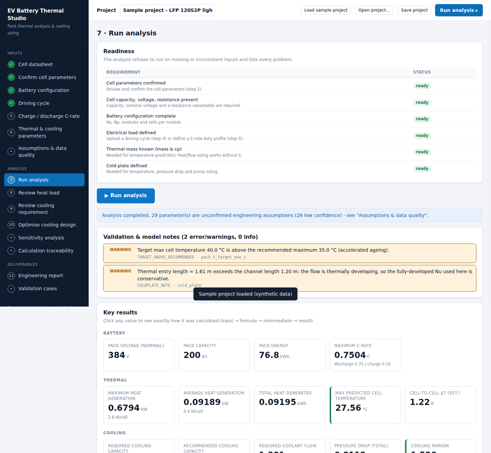
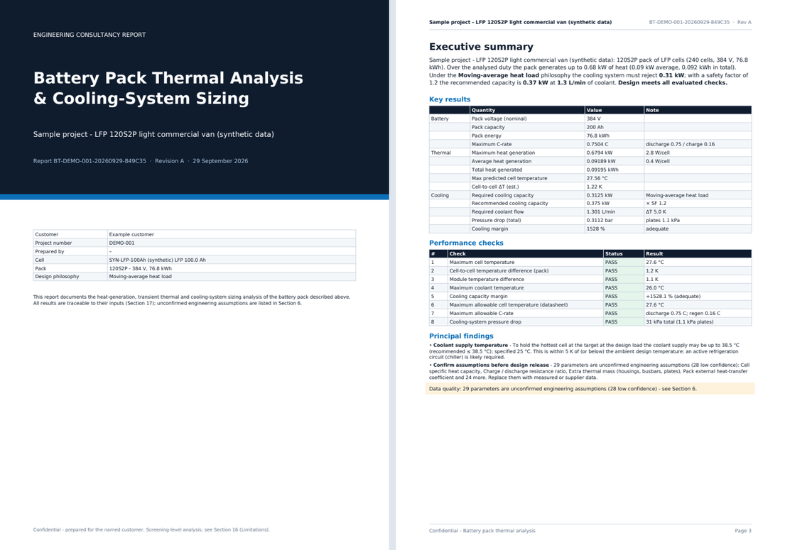

# EV Battery Pack Thermal Analysis & Cooling-System Sizing Tool

A web tool for an EV-battery consultancy. The customer supplies **cell data**, a **pack configuration** and a **driving cycle**;
the tool returns a technically traceable analysis of

**cell / module / pack heat → transient thermal load over the cycle → required cooling capacity and coolant flow →
cold-plate, pump and radiator/chiller sizing → thermal margin and safety factor → an OEM-style PDF and Excel report.**

Python 3.11 · FastAPI · NumPy / pandas · Pydantic v2 · Plotly.js (served locally) · ReportLab / matplotlib · openpyxl.
The calculation engine (`battery_thermal/engine`) has no dependency on the web layer; the API is a thin wrapper.



> **What this is and is not.** A screening-level tool: a lumped (uniform-temperature) thermal model with screening estimates
> for cell-to-cell spread, laminar/turbulent channel correlations, and radiator figures that are *requirements*, not a
> radiator design. It does not replace CFD, a 1-D flow-network model or a module-level thermal test.
> **The bundled sample data are synthetic** (a made-up 100 Ah LFP cell and van) - they exist to demonstrate the workflow
> and are labelled as such everywhere. The tool never invents cell data: anything you did not supply is listed as an
> *assumption* with a confidence level (report Section 6 / *Assumptions* sheet).

---------------------------------------------------------------------------

## Quick start

```bash
python -m venv .venv && source .venv/bin/activate
pip install -r requirements.txt
uvicorn battery_thermal.api.main:app --reload          # http://127.0.0.1:8000
```

Click **Load sample project** (top bar), press **Run analysis**, then open *Engineering report*.
Interactive API documentation: `http://127.0.0.1:8000/docs`.

```bash
docker build -t battery-thermal . && docker run --rm -p 8000:8000 battery-thermal
```

The server is stateless: uploaded files are parsed in memory, nothing is written to disk, and the project
(*Save project* / *Open project…*) lives in the browser and in a JSON file you keep.

## The workflow (left-hand navigation)

| # | Step | What happens |
|---|------|--------------|
| 1 | **Cell datasheet** | Upload PDF / Excel / CSV (or start from the CSV/XLSX template). The parser *proposes* chemistry, type, capacity, voltages, DC/AC resistance, R vs SOC / T / map, OCV vs SOC, dU/dT, capacity vs T, C-rates, pulse capability, dimensions, mass, temperature ranges. |
| 2 | **Confirm cell parameters** | Every extracted value is shown with its source line, editable, and must be **confirmed** before any calculation runs. |
| 3 | **Battery configuration** | Ns, Np, modules, cells per module, SOC window, temperatures; validated against the cell data (voltage/capacity/energy consistency). |
| 4 | **Driving cycle** | CSV/Excel upload with column detection and unit heuristics; data-quality checks (gaps, duplicates, non-uniform steps, missing signals, SOC range); opt-in logged repairs. Speed-only cycles use the **road-load model**. |
| 5 | **Charge / discharge C-rate** | Continuous / peak (with duration) discharge, charge, regen; optional C-rate duty profile instead of a cycle. |
| 6 | **Thermal & cooling parameters** | Resistance model level and extrapolation policy, entropic heat, design philosophy, coolant, cold plate, pump, limits. |
| - | **Assumptions & data quality** | The register of every parameter with source class (user / datasheet / calculated / assumed) and confidence. |
| 7 | **Run analysis** | Readiness list, run, KPIs, the eight PASS / WARNING / FAIL checks. Click any KPI to open its **input → formula → intermediate → result** trace. |
| 8 | **Review heat load** | The seven graphs, per-time-step table, peak / average / energy, four design-load philosophies side by side. |
| 9 | **Review cooling requirement** | Coolant flow (cell / module / pack), cold-plate resistance chain (R vs U explained), hydraulics, pump, radiator estimate, recommended inlet temperature. |
| 10 | **Optimise cooling design** | Grid search for the lowest pump power that still meets all thermal and hydraulic limits. |
| - | **Sensitivity analysis** | One-at-a-time perturbation of 12 parameters with the whole analysis re-run; tornado charts. |
| - | **Calculation traceability** | Index of every recorded quantity with its formula, substituted numbers and dependencies. |
| 11 | **Engineering report** | 17-section PDF and Excel workbook. |
| - | **Validation cases** | Built-in hand calculations versus the same engine, side by side. |

## What is calculated

```
Electrical load ─► Cell heat generation ─► Thermal accumulation ─► Cooling requirement ─► Cooling-system sizing
```

| Quantity | Model |
|----------|-------|
| Pack quantities | `V = Ns·V_cell`, `C = Np·C_cell`, `E = Ns·Np·C_cell·V_nom`, `I_cell = I_pack/Np`, `C-rate = I_cell/C_cell` (positive = discharge) |
| Road load (speed only) | `F = m(1+ε)a + Crr·m·g·cosθ + ½ρCd·A·v² + m·g·sinθ`, `P_wheel = F·v`, `P_batt = P_wheel/η` (`·η·f_regen` when braking) `+ P_aux` |
| Power → current | `(OCV − I·R)·I = p` → `I = 2p/(OCV + √(OCV² − 4Rp))`; infeasible power is limited and flagged |
| Resistance | Level 1 constant · 2 `R(SOC)` · 3 `R(T)` · 4 `R(SOC,T)` (map or separable); interpolated; **extrapolation blocked unless explicitly enabled**; the level used is stated |
| Heat | `Q_joule = I²R`, `Q_rev = −I·T·dU/dT` (never silently dropped), `Q_pack = Ns·Np·Q_cell`; **electrical energy is not heat** |
| Thermal | `C·dT/dt = Q − G_c(T − T_in) − G_a(T − T_amb)`, `G_c = ε·ṁ·cp`; integrated exactly per step (exponential integrator), sample-and-hold heat |
| Design load | Peak · trailing moving average · sustained (steady state at the continuous C-rate) · drive-cycle (smallest constant removal that holds the target); `Q_design = (Q_relevant + Q_ambient)·SF` |
| Coolant flow | `ṁ = Q/(cp·ΔT)`, `V̇ = ṁ/ρ` at cell, module and pack level |
| Cold plate | `R_total = R_contact + R_TIM + R_plate + R_conv`, `U = 1/(R_total·A_ref)`; ε-NTU coolant exchange; screening cell-to-cell ΔT |
| Hydraulics | Shah-London laminar `f·Re`/`Nu` for rectangular ducts, Haaland / Gnielinski turbulent, linear blend in transition; `ΔP = f(L/D_h)½ρv² + K½ρv² + external`; `P_hyd = ΔP·V̇`; `P_el = P_hyd/η_pump` |
| Sizing | Installed capacity, flow, maximum inlet temperature, pump duty (×1.1 flow / ×1.2 pressure), radiator heat rejection and air flow, chiller flag when the supply is within 5 K of ambient |
| Margins | Cooling margin classes (configurable): `< 0 %` insufficient, `0-10 %` warning, `10-20 %` moderate, `≥ 20 %` adequate; thermal margin in kelvin |

The full derivations are in [`docs/00_DESIGN.md`](docs/00_DESIGN.md).

**Rules the tool enforces:** it refuses to run on unconfirmed or inconsistent inputs and lists every problem; a constant heat
value is never used when a transient cycle exists; missing data give **N/A with the reason**, not a silent assumption;
engineering defaults are always labelled *Assumed* with a confidence; every result has a trace.

## Reports

`POST /api/report/pdf` and `POST /api/report/xlsx` recompute the analysis from the posted request, so a report always matches its inputs.



* **PDF** (~20-25 pages): cover, contents with verified page numbers, executive summary, then the 17 sections - customer & project ·
  cell · battery configuration · driving cycle · input data · assumptions & data quality · calculation methodology ·
  heat-generation calculation (worked example at the peak instant, 7 graphs, time-step extract) · thermal-load results ·
  cooling requirement · cooling-system sizing · pressure drop · thermal performance (checks, resistance chain, temperatures, margins) ·
  sensitivity · engineering recommendations · limitations · complete calculation traceability. PDF bookmarks mirror the sections.
* **Excel** (12 sheets): Summary · Inputs · Assumptions · Heat results · Cooling · Checks · Sensitivity · **Hand calcs**
  (live Excel formulas that re-derive the key numbers next to the engine value, plus the built-in 120S1P/200 A case) ·
  **Traceability** (clickable dependency links) · Charts (native Excel charts) · **Timeseries** (every time step) · Notes.
  Text from customer files is always stored as text - never interpreted as a formula.

## Validation and tests

```bash
pip install -r requirements-dev.txt
pytest                                   # 247 tests, about 2 minutes
python scripts/ui_smoke.py --steps "" --script scripts/ui_flow_full.py      # browser flow (Playwright + Chromium)
```

* **Hand calculations, in every phase and in the app.** The *Validation cases* tab (and `GET /api/validation/cases`,
  `POST /api/validation/run`) runs five closed-form cases through the same `run_analysis` that serves a project - constant
  current 120S1P/200 A (`Q_cell = I²R = 40 W`, `Q_pack = 4.8 kW`), a time-varying cycle with regen and rest, a road-load cruise,
  a cold-plate / hydraulics chain, and lumped thermal accumulation - 60 comparison rows, each with its tolerance.
* **Independent references.** Literature anchors for the correlations (square duct `f·Re = 56.91`, `Nu_H1 = 3.61`; parallel plates 96 / 8.235;
  Petukhov, Gnielinski), analytic step responses, conservation identities, a plain-Python re-implementation of the time-varying case,
  and **SciPy** (`solve_ivp`, `RegularGridInterpolator`, `brentq`) re-deriving the engine's integrator, interpolation and solvers.
* **Negative tests** for every error class in the specification, round-trip tests for datasheet templates, and report tests that
  check section coverage, TOC page numbers, key numbers, traceability links and workbook formulas.

Details per phase: [`docs/01_PHASE_LOG.md`](docs/01_PHASE_LOG.md).

## API at a glance

| Method | Path | Purpose |
|--------|------|---------|
| GET | `/api/health`, `/api/defaults` | status; generic engineering defaults, parameter catalogue, philosophy texts |
| POST | `/api/datasheet/parse`, `/api/drivecycle/parse` | ingestion: returns *proposed* values with source lines and issues |
| GET | `/api/templates/datasheet.csv`, `.xlsx`; `/api/samples`; `/api/sample-project` | templates and the synthetic sample |
| POST | `/api/config/validate`, `/api/coolant/properties`, `/api/resistance/levels`, `/api/load/preview` | step-wise validation and previews |
| POST | `/api/analyze` | complete analysis (results, checks, series, trace, assumptions) |
| POST | `/api/sensitivity`, `/api/optimize` | sensitivity analysis; cooling-design search |
| POST | `/api/report/pdf`, `/api/report/xlsx` | reports (HTTP 422 with a readable message if the analysis is blocked) |
| GET/POST | `/api/validation/cases`, `/api/validation/run` | built-in validation cases |

## Project layout

```
battery_thermal/
  engine/            schemas · units · interp · trace · validation · pack · vehicle · load · resistance · electrical · heat
                     simulation · summary · thermal · coolant · cooling · coldplate · channel · pressure_drop · sizing · checks
                     sensitivity · optimizer · assumptions · pipeline        (pure calculation, no web code)
  ingestion/         datasheet (PDF/XLSX/CSV) · drive_cycle · common
  reporting/         pdf_report · excel_report · charts · text · labels
  validation_cases/  cases (hand calculations) · sample_project
  api/               FastAPI routes + static UI (vanilla ES modules, no build step)
tests/  scripts/  sample_data/  docs/
```

## Known limitations

* Lumped thermal model; the cell-to-cell / module ΔT is a screening estimate (coolant rise along the flow path, heat-generation spread,
  flow maldistribution) - confirm with CFD or a module test.
* Coolant properties use built-in correlations (ρ, cp ±2 %, k ±5-10 %, μ ±10 %); use supplier data for a final design.
* Correlations assume fully developed single-phase flow in rectangular channels; manifold, header and bend effects enter only through the loss coefficient.
* Radiator / chiller figures are heat-rejection *requirements*; final sizing needs air-side and exchanger-design data.
* PDF datasheet extraction depends on the layout of the document (text-based PDFs only, no OCR): that is why extraction is always reviewed and confirmed.
* Time integration is sample-and-hold; spikes between the samples of a coarsely sampled cycle are not represented.
* A load definition is limited to 500 000 time steps (about 138 h at 1 Hz); resample longer cycles.

See report Section 16 for the complete list.
